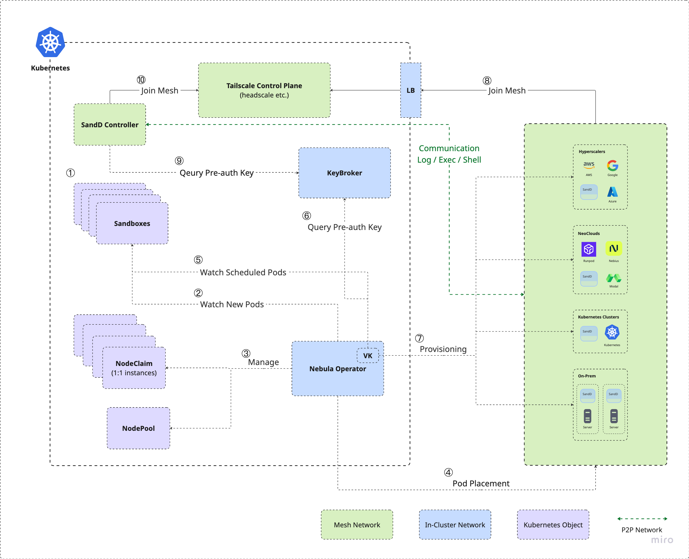

# Nebula Architecture

This is the design for where Nebula is going: one Kubernetes API surface over every
GPU workload class:

- sandboxes and agents, notebooks
- inference and services
- training and fine-tuning jobs

All running on remote instances across NeoClouds and hyperscalers.

- [Goals and non-goals](#goals-and-non-goals)
- [Workload classes](#workload-classes)
- [Decisions](#decisions)
  - [1. Dial-out, not a mesh](#1-dial-out-not-a-mesh)
  - [2. The kubelet API lives on the virtual node](#2-the-kubelet-api-lives-on-the-virtual-node)
  - [3. SandD is PID 1](#3-sandd-is-pid-1)
  - [4. A Sandbox CRD, above the Pod](#4-a-sandbox-crd-above-the-pod)
  - [5. Inbound is a provider capability](#5-inbound-is-a-provider-capability)
- [Provider seam changes](#provider-seam-changes)
- [Roadmap](#roadmap)
- [Risks](#risks)

---

## Goals and non-goals

**Goals**

- A single API surface for all GPU workloads, across providers.
- `kubectl logs` / `exec` / `attach` against a remote instance, natively.
  offer no native exec API and no inbound reachability.
- In-cluster clients reach a remote service like inference or microservice.
- Per-provider code stays small: adding a provider must not mean re-implementing
  logs, exec, or stats.

**Non-goals (for now)**

- **Gang scheduling and intra-gang connectivity** — multi-instance workloads that
  provision all-or-nothing and can reach each other. Deferred, not abandoned: it is
  what training and fine-tuning need, and the one genuinely new primitive here. The
  near-term constraint is only that nothing else deepen `NodeClaim.spec.podRef`'s 1:1
  relationship with a Pod (`api/v1alpha1/nodeclaim_types.go:18`), so it stays
  reachable. See [Deferred](#deferred--training-fine-tuning-jobs).

**Non-goals**

- Multi-container Pods, init containers, and image-level restart on remote
  instances. These need container-runtime access, which not every provider grants.
- An overlay network of any kind (see [Decision 1](#1-dial-out-not-a-mesh)).
- In-place migration of a running workload between providers.

## Workload classes

Four classes, three phases.

| Class | CRD | Inbound to instance | Group | Lifetime | Phase |
|---|---|---|---|---|---|
| sandbox, agent, shell | `Sandbox` | no | 1 | minutes–days | 1 |
| notebook | `Notebook` | no (consumer terminates in-cluster) | 1 | hours–days | 1.5 |
| inference, services | Deployment + Service | **yes**, from arbitrary clients | N fungible | long | 2 |
| training, fine-tuning, jobs | (TBD) | **yes**, from peers only | N ordinal, all-or-nothing | bounded | deferred |

One CRD per shape, each synthesizing Pods onto the existing placement path. Inference
needs no CRD at all: a Deployment of labeled Pods already provisions N instances, and
replicas/rolling-update/HPA are what Deployment does well. What it lacks is
reachability, which is [Decision 5](#5-inbound-is-a-provider-capability).

---

## Decisions

### 1. Dial-out, not a mesh

**Decision.** The in-container SandD opens **one long-lived WSS connection per
instance** to a stable public endpoint, authenticated by a short-lived JWT whose
audience is the workload identity. No overlay network, for any class.

```
   instance (any cloud, behind NAT)          your cluster
   ┌─────────────────────────────┐
   │ container                    │
   │  SandD (PID 1) ──────────────┼──outbound TLS 443──▶ LB ──SNI──▶ WS server
   │   └─ workload as child       │                                  map[claim]conn
   └─────────────────────────────┘
```

**Why the connection must be persistent.** A real kubelet needs no such thing: the
apiserver *dials it*, because it has a routable address. A Nebula instance sits
behind NAT in another cloud, so the apiserver cannot dial it and the direction must
flip. Once flipped, the connection has to *already exist* when a request arrives —
`kubectl exec` is synchronous, and there is no other channel over which to ask the
instance to dial in.

Cost: one idle TLS connection per instance, carrying zero traffic until someone
runs a command. 10k of them is an ordinary WebSocket server in a single process.

**Why not a mesh (headscale/Tailscale).** A mesh solves the same reachability
problem and needs less development work since coordinator already exists, but headscale has a performance issue when reaching around 500 nodes, see [headscale#1656](https://github.com/juanfont/headscale/issues/1656).



**Revisit if** dial-in becomes a product feature: operator SSH into any box, a
pull-based metrics scraper, or instance-to-instance traffic *across* providers.

### 2. The kubelet API lives on the virtual node

**Decision.** Implement the kubelet HTTP surface on the virtual node and serve
logs/exec/attach from it, forwarding over the instance's WebSocket.

```
kubectl exec pod-x
   └─▶ apiserver ──HTTPS──▶ virtual-node kubelet endpoint (Nebula manager)
                               └─▶ map[claim]conn ──▶ SandD ──▶ container
```

**What it buys.** Every consumer works unmodified — `kubectl`, `client-go`, other
languages' clients, k9s/Lens/ArgoCD, our own controllers — and authorization is
RBAC on `pods/exec` and `pods/log`, namespace-scoped, so a tenant's workload can only exec into its own Pods.

Each subresource is a separate handler:

| Subresource | Handler | Phase |
|---|---|---|
| `exec`, `attach` | `RunInContainer`, `AttachToContainer` | 1 |
| `logs` | `GetContainerLogs` | 1 |
| `port-forward` | `PortForward` | 2 |
| `top` | `GetStatsSummary` | later |

### 3. SandD is PID 1

**Decision.** SandD runs as PID 1 in the workload container and spawns the
workload as its **child**, owning its stdout/stderr pipes.

### 4. A Sandbox CRD, above the Pod

**Decision.** Add one namespaced `Sandbox` CRD. It **creates one Pod**; it does not
replace or bypass it. No class object, no `type` discriminator — a Sandbox is a
sandbox. Other shapes (Notebook, and later a training Job) become their own CRDs
when they need their own spec, each reusing the same Pod path underneath.

```
Sandbox
  ├── creates Pod (1, ownerRef'd, restartPolicy: Never, NO command)
  │      └── gate → placement → nodeSelector → virtual node
  │             └── VK CreatePod → NodeClaim → instance
  └── owns lifecycle: stop/start, TTL, idle-cull, endpoints
```

**Why a Pod underneath.** The Pod is the carrier of everything already built:
placement, `pkg/failover`'s blocklist, and — critically — the NodeClaim finalizer
that guarantees a paid instance is never leaked. It is also what ResourceQuota
counts, which is how one tenant is stopped from provisioning fifty H100s. Bypassing
it would mean reimplementing all of that.

**Why not a Deployment.** Replicas are *fungible*; a sandbox has identity — its
disk, its claim name, its live sessions. A rolling update would silently swap a
user's box out from under them, and the Deployment controller's recreate-on-exit
fights the `Stopped` state below.

**Why a CRD at all**, rather than a labeled Pod. Three things a Pod cannot express:

1. **Identity that outlives the instance** — the disk and claim name survive a
   reprovision.
2. **`desiredState: Running | Stopped`** — release a $3/hr GPU while keeping the
   volume. A large economic lever, and meaningless on a Pod.
3. **`status.endpoints` + `lastActivityTime`** — a stable address and the idle
   signal that drives culling.

```yaml
kind: Sandbox
metadata: {name: alice-1, namespace: team-ml}
spec:
  nodePoolRef: gpu                    # existing placement policy object
  image: ubuntu:24.04
  accelerator: nvidia-a100
  desiredState: Running               # Stopped releases the GPU, keeps the volume
  ttl: 8h
  idleTimeout: 30m                    # omit to disable culling
  storage: {size: 100Gi, retainOnStop: true}
status:
  phase: Ready
  endpoints: {exec: ..., pty: ...}
  lastActivityTime: "2026-08-07T09:12:00Z"
  nodeClaimRef: {name: team-ml-alice-1}
```

**No command, by design.** SandD is PID 1 and there is no user program to wrap. A
sandbox is a box you talk into, not a program that runs.

**Why no SandboxClass.** An earlier draft had a cluster-scoped class holding image,
ports, TTL, and storage, on the theory that it avoided a `type:` discriminator. But a
discriminator was never the alternative — every field above is meaningful on every
sandbox, so there is nothing mutually exclusive to factor out. And the StorageClass
analogy does not hold: a PVC author genuinely cannot know the provisioner, whereas
here `nodePoolRef` is already the admin-owned policy object. A class would be a
second object to reason about for no present benefit, and it invites a
`spec.overrides` escape hatch that reproduces the whole spec inline.

Add it later **if** self-service multi-tenancy arrives — where users may create
Sandboxes but must not choose arbitrary images or GPU types, making an admin-owned
class a real security boundary. That is additive (`classRef` plus webhook
defaulting), not a migration.

**Why notebook is a future CRD, not a Sandbox variant.** A notebook needs fields a
sandbox does not: a served HTTP port, a proxied URL in status, per-user auth, and a
process to start once the box is ready — the notebook server is launched by a
post-ready **exec through the control channel**, not as a container command. That
last point is what makes it a different resource rather than a flag: restart Jupyter
without recreating the instance, a crash does not kill the box or the session, and a
second process (TensorBoard) can be added to a running notebook later.

Sandbox ships first and proves the machinery — Pod synthesis, stop/start, idle-cull,
endpoints in status, SandD lifecycle. Notebook then reuses all of it plus
`PortForward` or the proxy.

**The WS server is the activity oracle.** It sees every exec, session, and proxied
request, so `lastActivityTime` flows SandD → server → `Sandbox.status`, and the
Sandbox controller culls on it. Nothing else can know this — the provider only knows
the instance is running.

**Open question — cold start for agent-exec.** A NeoCloud GPU instance takes minutes
to become Ready; a code-interpreter call wants sub-second. Three options: (a) 1:1
Sandbox↔instance and accept the latency; (b) a warm standby pool, still 1:1, paying
for idle GPUs; (c) N Sandboxes multiplexed onto one warm instance. Option (c) needs
a per-instance runtime that can launch containers on demand — a different component
from a single-tenant SandD — and breaks `NodeClaim.spec.podRef`'s 1:1 relationship
(`api/v1alpha1/nodeclaim_types.go:18`). Start at (a); do not deepen the 1:1
assumption elsewhere, so (b) or (c) stays reachable.

### 5. Inbound is a provider capability

**Decision.** Inference reachability is resolved per provider in three tiers, all
converging on one consumer-facing abstraction: a **selector-less Service** plus an
EndpointSlice that Nebula populates.

| Tier | Mechanism | Providers |
|---|---|---|
| **A. Native endpoint** | the provider hands us a URL | Modal (tunnels — already implemented, `pkg/provider/modal/client.go:270`) |
| **B. Direct L3** | security group opens the port; clients hit the instance IP | AWS |
| **C. Gateway** | instance dials out; an in-cluster gateway accepts consumers | providers with no inbound path at all |

Prefer A, then B. C is a fallback taken knowingly, per provider, because it puts a
hop in the token path — it must not be the default, which is exactly what a
mesh-everywhere design would have locked in.

**Why the Service must have no selector.** A selector-based Service would have its
EndpointSlices auto-populated with the *virtual node's* notion of pod IP, which is
useless. The real address lives in the endpoint annotation
(`persistEndpoint`, `pkg/vnode/handler.go:545`), so Nebula writes the EndpointSlice
itself with `endpointslice.kubernetes.io/managed-by: nebula`. Then kube-proxy
load-balances to off-cluster IPs and every existing client — `my-llm.default.svc` —
works unmodified.

**Readiness is a correctness prerequisite, not a feature.** `applyState` sets
`Ready=True` as soon as the provider reports *running*
(`pkg/vnode/status.go:74`), but vLLM needs minutes more to load weights. Routing on
that blackholes traffic on every rollout. An endpoint must not become `ready` until a
real probe passes. Modal already enforces the Pod's probe internally
(`SandboxSpec.ReadinessProbe`); for AWS this means probing in the VK poll loop
(`reconcileOnce`) and gating the Ready condition on the result.

**Never through the control channel.** One process holding 10k connections must not
also carry token streams: it would become a throughput bottleneck and a single
failure point for serving. Control plane and data plane stay separate. The one
exception is `kubectl port-forward` over the existing WebSocket — correct for
debugging, a notebook, or an admin API, and explicitly not for model serving.

**Training's inbound is different.** Rank-to-rank connectivity is inbound, but from a
*closed, known* peer set — so it is a provider-native rule scoped to the placement
group (same subnet, allow-from-self security group, EFA/RDMA where available), not
exposure to anything outside. It is a provisioning-time property, which is why it is
coupled to the gang primitive rather than to this tier system.

---

## Provider seam changes

Four changes to `pkg/provider`, all small, all shared by every phase.

**1. One interface for pod access, SandD-backed by default.**

```go
type PodAccess interface {
	Logs(ctx context.Context, claim string, opts LogOptions) (io.ReadCloser, error)
	Exec(ctx context.Context, claim string, cmd []string, io AttachIO) error
	Stats(ctx context.Context, claim string) (Stats, error)
}
```

The SandD-backed implementation works everywhere. A provider *may* supply a native
one (Modal's SDK exec) as a pure optimization; nothing breaks if it does not. This is
what keeps "add a provider" from meaning "reimplement logs and exec".

**2. One per-provider primitive for getting SandD in.** This is the only place
provider difference is irreducible:

```go
InjectFiles(spec *InstanceSpec, files []File) error
```

AWS already has this in effect — host fetch plus a read-only bind mount
(`sanddHostFetchScript`). Modal uses its own file/image mechanism. Anything else
falls back to a `/bin/sh` bootstrap that curls the binary and execs it. One small
function per provider, and the whole kubelet surface follows.

**3. `Instance.Endpoint string` becomes named, typed addresses.** Modal is the
forcing case, not a hypothetical: it creates one tunnel *per port* and `observe`
collapses them into a single string (`pkg/provider/provider.go:192`).

```go
type Address struct {
	Name      string       // "http", "grpc" — matches the containerPort name
	Host      string
	Port      int32
	Reachable Reachability // Native | Direct | Gateway
}
```

`Reachable` is what tells the EndpointSlice bridge whether to write the address
directly or point at a gateway. Do this **before** two consumers hardcode the
string: sandbox wants a control channel, inference wants `http`.

**4. `Capabilities` gains the access questions** (`pkg/provider/provider.go:151`):

```go
NativeExec     bool         // Modal: true → no SandD needed for exec
NativeEndpoint bool         // Modal: true (tunnels)
InboundMode    Reachability // which tier this provider uses
```

Also: SandD injection moves from **per-provider** (`KeyMinter != nil`, which injects
into every workload on that provider) to **per-workload**, carried on
`InstanceSpec`. Required regardless — inference and training Pods must be able to opt
out.

---

## Roadmap

Each phase builds the seam the next one needs. Nothing is built twice.

### Phase 1 — Sandbox, agent, shell

*Goal: `kubectl exec`/`logs` work against a remote box, driven by a CRD.*

SandD side (gating — these block everything else):

1. Plain-TLS dial-out with a bearer JWT, alongside the existing `--tunnel` mode.
2. SandD as PID 1, spawning the workload as a child and owning its pipes.
3. Registry-based entrypoint resolution, so no `command` is required.

Nebula side:

4. `SanddConfig` → dial-out: drop `ControlServer`, `AuthKey` → `Token`. The
   keybroker becomes a JWT signer — same call site at Provision, same env-injection
   seam in `writeSanddEntrypoint`; it loses its headscale admin coupling rather than
   gaining anything.
5. WS server holding `map[claim]conn`. **In the manager if SandD has a Go
   server implementation; otherwise one shared gateway Deployment** that the VK
   calls over HTTP. Not one per workload — see [Risks](#risks).
6. Kubelet serving stack on the VK: `vkapi.PodHandler`, address advertisement,
   serving cert, TokenReview/SubjectAccessReview.
7. Implement `RunInContainer`, `AttachToContainer`, `GetContainerLogs`.
8. `Sandbox` CRD and its controller: Pod synthesis, stop/start, TTL, idle-cull,
   endpoints in status.
9. Delete: `errSanddNeedsCommand`, the shim supervisor loop, the Tailscale fetch,
   the headscale half of `config/sandd`, and the `SANDD_TUNNEL_SERVER` substitution
   dance in `Makefile`/`hack/deploy.sh` (a headscale constraint, not ours).

Pull forward from Phase 2 if convenient: the `Instance.Endpoint` widening (seam
change 3). Cheap now, annoying once two consumers depend on the string.

### Phase 1.5 — Notebook

*Goal: a browser reaches Jupyter on a remote box.*

A separate `Notebook` CRD reusing everything Phase 1 built. What it adds:

1. `PortForward` on the VK, or the controller-side proxy, for the HTTP/WS surface.
2. A post-ready **exec** that starts the notebook server — not a container command,
   so it can be restarted without recreating the instance.
3. A proxied URL in `status.endpoints`, plus per-user auth on it.
4. Volume support in the provider seam, so the home directory survives a
   reprovision. Nothing in the AWS adapter wires block devices today; this is the
   same gap training's checkpoints hit.

### Phase 2 — Inference and services

*Goal: `my-llm.default.svc` resolves to an off-cluster instance.*

1. Named addresses + `Reachability` (if not pulled into Phase 1).
2. `Capabilities` access flags; per-workload SandD opt-in.
3. **Real readiness probing** gating the Ready condition — a correctness fix.
4. EndpointSlice bridge: selector-less Service + Nebula-managed endpoints.
5. Per-provider inbound: Modal native (nearly free), AWS security groups.

### Deferred — Training, fine-tuning, jobs

*Goal: multi-instance, all-or-nothing, mutually reachable. A [non-goal for now](#goals-and-non-goals); listed so the near-term work does not foreclose it.*

1. **Gang scheduling** — N instances all-or-nothing, so a partially provisioned
   8-node job does not bill while waiting. `NodeClaim.spec.podRef` is 1:1
   (`api/v1alpha1/nodeclaim_types.go:18`), so this needs a group concept. It is the
   one genuinely new primitive in this document.
2. **Intra-gang L3** — shared subnet, placement group, EFA/RDMA, allow-from-self.
   Provider-native, never an overlay.
3. **Rank injection** — `RANK`, `WORLD_SIZE`, `MASTER_ADDR`, stable ordinals.
4. **Job semantics** — exit code → terminal `Succeeded`/`Failed`. Mostly free from
   Phase 1's PID-1 SandD, which already reaps the child; `applyState` needs to
   represent it.
5. **Shared storage** for checkpoints — the same missing provider field as notebook
   persistence. Nothing in the AWS adapter wires block devices today.

Logs and exec come free from Phase 1: same SandD, same connection.

---

## Risks

**Apiserver → manager reachability.** The apiserver dials the address the virtual
node advertises, so the manager pod's IP must be routable from the control plane.
Fine on VPC-CNI (EKS). **Not** guaranteed on overlay CNIs, and konnectivity or
egress-selector clusters need explicit configuration. This is the one item that
could invalidate Decision 2, and it is cheap to test — **validate it in a real
cluster before building the rest of Phase 1.**

**Cross-repo dependency on SandD.** Items 1–3 of Phase 1 are SandD-side. In
particular, whether SandD has (or will have) a **Go** server implementation
decides whether the WS server lives in the manager or in a separate gateway
Deployment. Confirm before starting item 5.

**Connection state is not reconstructible.** Restarting the connection holder kills
live `exec` sessions and reconnects every SandD instance at once. Real kubelets behave the
same way on restart, so it is a familiar failure mode — but it means backoff with
jitter belongs in SandD (not optional), and log streaming should be resumable by
offset rather than assuming a durable stream.

**The per-workload controller is dropped.** The earlier design gave each workload its
own controller Deployment so consumers could dial it directly with per-tenant
isolation. With the apiserver as the front door, isolation comes from
SubjectAccessReview instead, and a per-workload controller would be 10k Deployments
and an extra hop for no benefit. One shared holder, keyed by claim name.

**Token lifetime versus workload lifetime.** A 24h token on an 8h notebook is fine;
a long-lived SandD outliving its token needs refresh. Simplest for Phase 1: issue a
token that outlives the class's max TTL and bound exposure with ownerRef GC. Decide
now — retrofitting refresh into SandD is worse than designing for it.
